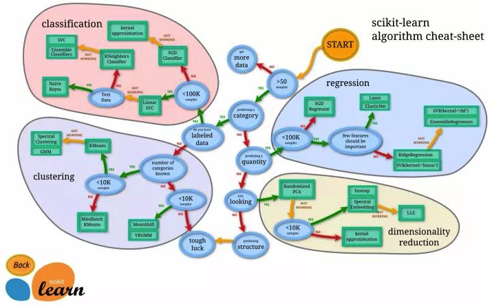

# basic

## ML定义
### Overview

> [AI、ML、统计学、数据挖掘之间有什么区别？](https://www.sohu.com/a/214247323_463989)

### Introduction

Machine learning is essentially a form of applied statistics with increased emphasis on the use of computers to statistically estimate complicated functions and a decreased emphasison proving confidence intervals around these functions;

we therefore present the two central approaches to statistics:

- frequentist estimators  频率派估计
- Bayesian inference.     贝叶斯推断

Most machine learning algorithms can be divided into the categories of
- supervised  learning    监督学习
- unsupervised  learning  非监督学习

Most deep learning algorithms are based on an optimization algorithm called

- stochastic gradient  随机梯度下降

### E T P definition

what do we mean by learning?

> A computer program is said to learn from experience E with respect to some class of tasks T and performance measure P, if its performance at tasks in T, as measured by P, improves with experience E.

E -> Data Set； supervised/unsupervised

T -> Function Set/Model； 回顾  分类  概率估计

P -> 准确率

O -> fitting

## P评估和O优化

## 数据预处理

## 线性回归

## 逻辑回归

## 神经网络

## SVM支持向量机

## 朴素贝叶斯

## 随机森林

## KNN

## PCA

## LSA

## NMF

## LDA

## k-means

## 混合高斯分布

## LLE

## t-SNE
